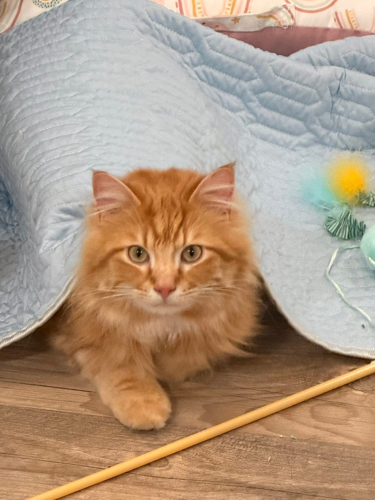

## Hi There 👋

My name is **Huangyi Tang**. 

I am a PhD student in the Department of Animal Science at Purdue University.

📊 My research focuses on **genomic selection (GS)** 🧬, **genetic parameter estimation** 📈, and **genetic diversity** 🔬.  
🛠️ I am also interested in developing small tools to make research workflows easier.

